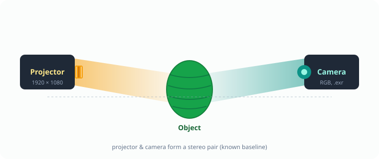

# 🔦 Stage 1 — 3D Scanning

### PSP Patterns & Phase Unwrapping

Generate phase-shift profilometry (PSP) projector patterns, capture them with a projector–camera stereo rig, then recover unwrapped phase maps and dense camera-to-projector pixel correspondences.


---

## 📖 Overview

This is the **first stage** of the pipeline. It builds the structured-light input that everything downstream depends on: a set of sinusoidal projector patterns, and — after you capture them on a real object — the geometry that links every camera pixel to a projector pixel with sub-pixel precision.

```
1️⃣ Create PSP patterns  ──▶  2️⃣ Project & capture (your rig)  ──▶  3️⃣ Unwrap phase + px↔px correspondence
```

## 📷 Capture setup

A projector and a camera form a calibrated **stereo pair** aimed at the object. The projector displays each PSP pattern in turn; the camera records the deformed fringes from its own viewpoint. Decoding the recorded phase tells us, for every camera pixel, which projector pixel illuminated it.

<div align="center">
  <br/>
  <em>Projector–camera stereo rig: patterns are projected (amber), the object distorts the fringes, and the camera records them (teal).<br/>Swap <code>stereo_setup.svg</code> for a photo of your own rig if you wish.</em>
</div>

## 📂 Files

| | File | Role |
|:--:|------|------|
| 1️⃣ | `create_projector_patterns.py` | **Step 1.** Generates the multi-frequency PSP projector patterns (and dark/white frames) into a folder. |
| 3️⃣ | `multifreq_hierarchical_PSP_TPU_and_px2pxcorresp.py` | **Step 3.** Reads the captured images, computes unwrapped height/width phase maps via hierarchical (cascade) unwrapping, and derives the camera-to-projector pixel correspondences. |
| 🖼️ | `projector_images/` | The generated patterns (already produced by Step 1). |

## ⚙️ Requirements

- 🐍 Python 3.9+
- 📦 NumPy, OpenCV (with OpenEXR support), imageio, matplotlib — see the combined [`requirements.txt`](../requirements.txt) at the repo root.

```bash
pip install -r ../requirements.txt
```

## 1️⃣ Create the projector patterns

Generates sinusoidal PSP patterns at several frequencies, in both the height and width directions, plus dark/white reference frames. These are what you display on the projector. *(The repo already ships a generated set in `projector_images/`.)*

```bash
python create_projector_patterns.py \
    --output-dir projector_images \
    --proj-width 1920 --proj-height 1080 \
    --num-phase-shifts 3 --gamma 1.77950210326
```

> 💡 Gamma matches your projector's measured response so the displayed fringes are truly sinusoidal. `--f-height-high` / `--f-width-high` set the highest fringe frequencies.

## 2️⃣ Capture with your projector–camera rig

This step happens on **your own hardware**. Using a calibrated projector–camera stereo setup, display every generated pattern on the object and record the corresponding camera image. We save captures as `.exr` (linear HDR), one file per pattern, named to match the projected pattern (e.g. `psp_height_f9_2.exr`), plus a `dark_frame.exr`.

> 📌 Keep filenames consistent with the projected patterns — Step 3 reads them back by name and frequency.

## 3️⃣ Unwrap phase & compute correspondences

Reads the captured images, subtracts the dark frame, masks to the object, decodes each frequency's wrapped phase, then unwraps **hierarchically** from the lowest to the highest frequency for robustness. From the unwrapped height/width phase it computes a dense, sub-pixel **camera→projector** correspondence map.

```bash
python multifreq_hierarchical_PSP_TPU_and_px2pxcorresp.py \
    --cam-imgs-dir /path/to/Object/Backview_4step \
    --sam-mask     /path/to/SAM_masks/Object/Backview/object_sam_HQ_output.npy \
    --proj-width 1920 --proj-height 1080 --num-phase-shifts 4 \
    --no-show       # omit to view the diagnostic figures
```

To also render the optional relighting preview (remap a virtual projector image into the camera view), add:

```bash
    --projector-img /path/to/projector_GT_images/ColorGrid.png \
    --white-frame   /path/to/Object/Backview_demosaiced/white_frame.exr
```

Outputs default to `--cam-imgs-dir`; override with `--output-dir`.

### 🎯 The SAM mask

A SAM-generated object mask is passed via `--sam-mask`. It selects **only the object** and excludes the background, table, rig, etc. Every captured frame is multiplied by this mask so that all downstream training patches come purely from the object — this prevents the SimSiam encoder from being poisoned by background pixels. The script additionally derives a stricter *valid-point* mask (from per-pixel offset/gamma modulation) to drop shadowed or poorly-modulated points inside the object.

## 📤 Outputs

Written to `--output-dir` (default `--cam-imgs-dir`):

- 🌀 `unwrapped_width.npy`, `unwrapped_height.npy` — refined unwrapped phase maps.
- 🧭 `px2px_corresp_width.npy`, `px2px_corresp_height.npy` — per-pixel projector column (xp) and row (yp) for each camera pixel.
- ✅ `valid_pts_mask.npy` — the cleaned valid-point mask inside the object.

These feed the later **[SSL pretraining](../2_SSL_Pretraining/README.md)** and **[post-SSL](../3_Post_SSL_Pretraining/README.md)** stages.
